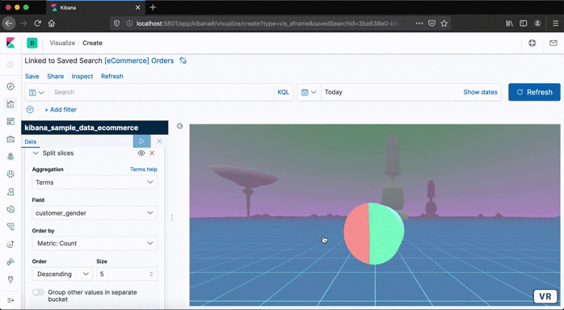
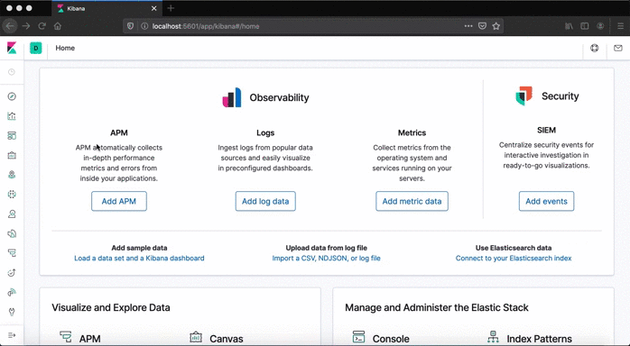

# KBN_AFRAME
Kibana plugin developed to display your data in a VR Experience Visualization.



### INSTALLATION

This plugin is available for **Kibana 7.5 or upper**.

#### From Releases

1. Download from [Releases](https://github.com/Camichan/kbn_aframe/releases "Releases").
2. unzip/untar into `KIBANA_HOME/plugins`.
3. Start Kibana.

If you choose Source Code, you'll need install dependencies (keep reading).

#### From Github Source Code

1. Move into Kibana's plugins folder: `cd KIBANA_HOME/plugins`
2. Clone the Github source code:
`git clone https://github.com/Camichan/kbn_aframe.git kbn_aframe -b 7.6`
3. Install dependencies:
```
cd kbn_aframe
rm -rf images
npm install
```
Now, you’ll be able to use this plugin in your Kibana.

#### Uninstall:
If you want to uninstall the plugin follow these steps:
```
cd KIBANA_HOME
rm -rf plugins/kbn_aframe/
```
### HOW TO USE

Use this plugin creating a new VR visualization. Works as Kibana's Pie Visualization.



> :bangbang: **IMPORTANT:** This plugin is currently under development.


### CONTACT
Please, help me to improve. [Send me](mailto:camaratomoyo@gmail.com) :e-mail: your troubles and feedback.
