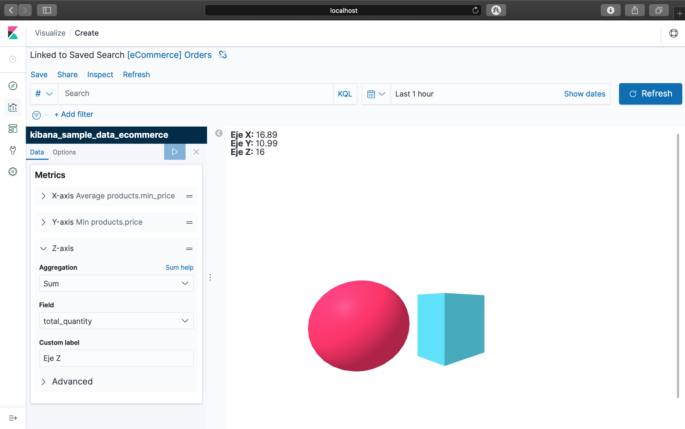

# KBN_AFRAME
Kibana plugin developed to display your data in a VR Experience Visualization.



### INSTALLATION

This plugin is avaliable for **Kibana 7.x or upper**.

#### From Github Source Code

1. Move into Kibana's plugins folder: `cd KIBANA_HOME/plugins`
2. Clone the Github source code:
`git clone https://github.com/Camichan/kbn_aframe.git`
3. Install dependencies:
```
cd kbn_aframe
rm -rf images
npm install
```
Now, you’ll be able to use this plugin in your Kibana.

#### Uninstall:
If you want to uninstall the plugin follow these steps:
```
cd KIBANA_HOME
rm -rf plugins/kbn_aframe/
```
### HOW TO USE

Use this plugin creating a new “VR Experience” visualization. Then entry your elasticsearch data (3 axis) to draw the box.


> :bangbang: **IMPORTANT:** This plugin is currently under development and it displays only a box with your data and a simple sphere.


### CONTACT
Please, help me to improve. [Send me](mailto:camaratomoyo@gmail.com) :e-mail: your troubles and feedback.
